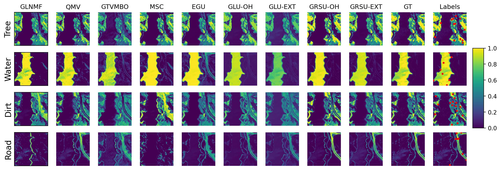
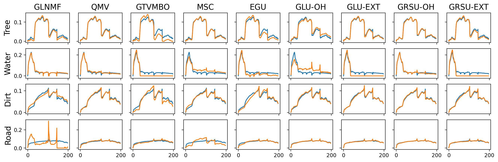

# Graph-based Active Learning for Nearly Blind Hyperspectral Unmixing
Bohan Chen, Yifei Lou, Andrea L. Bertozzi, Jocelyn Chanussot
___________

The repository implements the method proposed in the paper *Graph-based Active Learning for Nearly Blind Hyperspectral Unmixing*.

**Estimated Abundance Maps for the Jasper Ridge Dataset**


**Estimated Endmember Spectra for the Jasper Ridge Dataset**


## Before You Start

### System Requirements
- Python 3.8 or 3.9 is required for running this repository.

### Install Required Libraries
1. Open your terminal and navigate to the project directory.
2. Run the following command to install the required packages:

    ```bash
    pip install -r requirements.txt
    ```

### Data Download
If you intend to reproduce the results from the paper or run the examples provided later, you will need to download the necessary dataset. You can download it using the following link:
[Google Drive Download](https://drive.google.com/uc?export=download&id=1jnM-g4WErsObOQEgjg8onj-M8j8ooopq)

## How to Run

### Precomputed Results
If you just want to get the precomputed results, you can directly run the following command. Please note that you need to download the corresponding data and replace the `processed_data` folder in this directory before running.
```bash
python main.py --dataset jasper
```
The `jasper` here can be replaced with `samson`, `urban`, and `apex`.

### Run Our Approach on Your Own Dataset
If you would like to run our method on your own dataset, you first need to create a `.npy` file that contains a dictionary with at least 3 keys: `X`, `A_gt`, and `S_gt`.

- `X` is an n * m * C HSI image.
- `A_gt` is the ground truth abundance map of size p * (n * m).
- `S_gt` is the ground truth endmember spectra of size C * p.

Here, `p` is the number of endmembers.

After preparing the `.npy` file, you can then run:

```bash
python main.py --dataset path --train_percentage 0.4 --AL_method mcvopt
```

Here `path` is the path to the `.npy` file of your own dataset. `train_percentage` is the percentage of training pixels, with default value `0.4`. `AL_method` specifies the type of acquisition function to be used in active learning with available choices `"vopt", "uc", "mc", "mcvopt"`. 

Note that in our GRSU method, there are some parameters that require tuning. Here, we use a fixed empirical value, but for specific datasets, we recommend using grid search to select the most appropriate parameters.

## License
Copyright (C) 2023 Bohan Chen

This program is free software: you can redistribute it and/or modify
it under the terms of the GNU General Public License as published by
the Free Software Foundation, either version 3 of the License, or
(at your option) any later version.

This program is distributed in the hope that it will be useful,
but WITHOUT ANY WARRANTY; without even the implied warranty of
MERCHANTABILITY or FITNESS FOR A PARTICULAR PURPOSE.  See the
GNU General Public License for more details.

You should have received a copy of the GNU General Public License
along with this program.  If not, see <https://www.gnu.org/licenses/>.

## Contact
If you have any further questions or run into issues, please feel free to reach out to Bohan Chen. You can email him at [bhchenyz@g.ucla.edu](mailto:bhchenyz@g.ucla.edu).